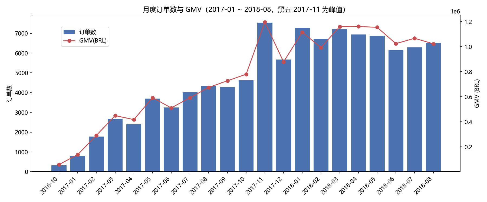
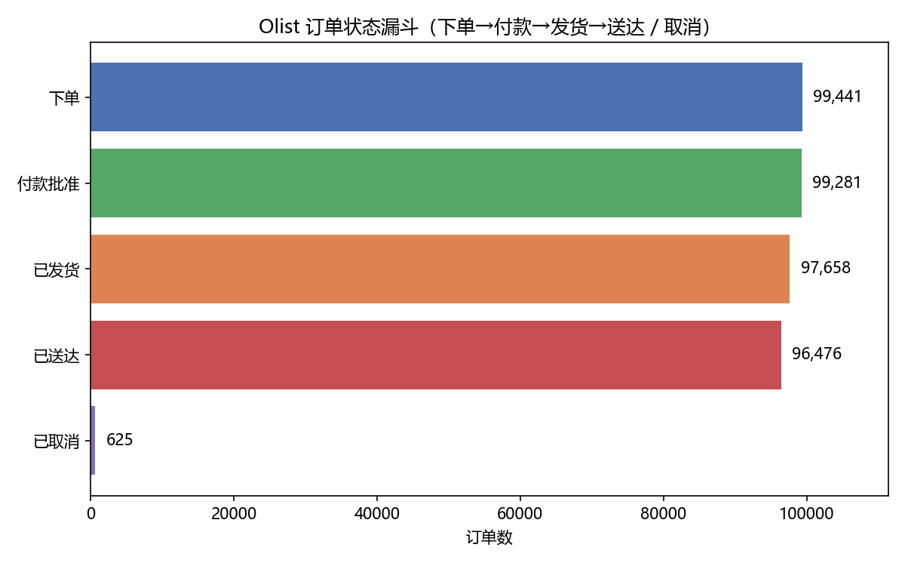
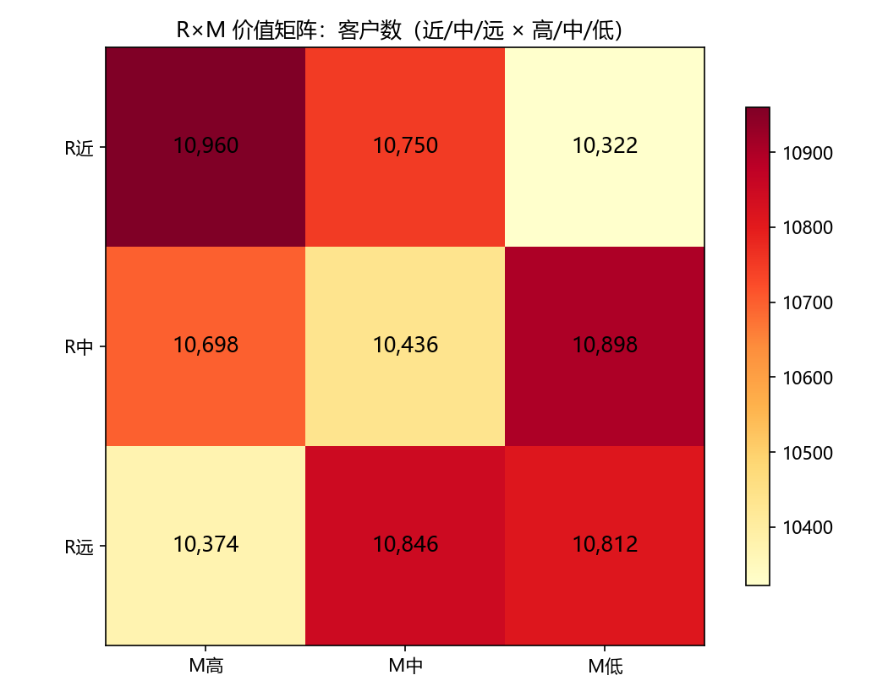

# 电商用户行为分析

<p align="center">
  
</p>

## 项目简介

基于 **Olist 巴西电商公开数据集**（真实订单数据，2016-09 ~ 2018-10，99,441 单）完成的分析项目，覆盖 MySQL 入库（ETL）、SQL 分析、Python 分析与图表、Power BI 看板和分析报告。

**诚实声明**：本数据为真实公开数据（Kaggle: Brazilian E-Commerce Public Dataset by Olist）。数据为巴西市场订单数据，结论不代表中国电商或其他平台。

## 核心结论

- 订单漏斗：下单 99,441 → 付款批准 99.8% → 发货 98.2% → 送达 97.0%；取消率 0.63%
- 总 GMV ≈ 1,600 万 BRL，客单价 161 BRL，信用卡支付占 78.3%
- 复购率仅 3.12%：96.9% 客户只买过 1 单 → RFM 的 F 失效，改用 R+M 价值分层
- M 高（前 1/3）客户贡献 68% GMV；月度留存长期个位数
- 平台以一次性购买为主，运营重心应为拉新与客单价，而非留存
- 平均评分 4.09（J 型分布）；平均送达 12.5 天 vs 承诺 24.4 天，晚到率 8.1%
- SP 州贡献 37.5% GMV；2017-11 黑五为全年峰值

详细方法与结果见 [report/分析报告_olist.md](report/分析报告_olist.md)。

## 看板预览（Power BI）

看板文件：`report/电商用户行为分析看板_olist.pbix`（5 页：总览 / 订单漏斗 / 客户价值 / 品类地区 / 评价物流）


## 关键图表






## 技术栈

Python 3.12（pandas、numpy、matplotlib、jupyter、PyMySQL、kagglehub）、MySQL 8.0 及以上、Power BI Desktop。

## 目录结构

```text
邱泽凯_电商用户行为分析/
├── data/
│   └── olist/raw/                      # 真实数据源（9 个 CSV，git 忽略）
├── scripts/
│   ├── olist_download.py               # 下载 Olist 数据（kagglehub）
│   ├── olist_import_to_mysql.py        # ETL：建表 + 导入 MySQL（olist_* 表）
│   ├── olist_run_sql.py                # 运行 sql/olist/ 分析 SQL
│   ├── olist_analysis.py               # Python 图表 + 导出表
│   ├── run_sql.py                      # 通用 SQL 执行器
│   └── setup_mysql.py                  # 初始化 ecommerce 库 + analyst 账号
├── sql/
│   └── olist/                          # 分析 SQL（漏斗/GMV/RFM/留存/品类地区/评价物流）
│       ├── 01_建表.sql
│       ├── 02_订单状态漏斗.sql
│       ├── 03_支付与金额分析.sql
│       ├── 04_时间规律.sql
│       ├── 05_RFM分层.sql
│       ├── 06_复购与留存.sql
│       ├── 07_品类地区GMV.sql
│       └── 08_评价与物流.sql
├── notebooks/
│   └── 邱泽凯_olist真实数据分析.ipynb   # 分析 notebook
├── report/
│   ├── 分析报告_olist.md               # 分析报告
│   ├── charts_olist/                   # 图表（11 张 png）
│   ├── exports_olist/                  # 导出表（供 Power BI 使用）
└── config/                             # 数据库连接（git 忽略）
```

## 运行方式

```bash
pip install pandas numpy matplotlib pymysql kagglehub
python scripts/olist_download.py            # 下载数据（已执行）
python scripts/olist_import_to_mysql.py     # ETL 入库（约 30 秒）
python scripts/olist_run_sql.py             # 运行全部 SQL 分析
python scripts/olist_analysis.py            # 生成图表与导出表
```

## 注意事项

- 复现需本机 MySQL 8.0+（SQL 使用 CTE 与窗口函数；本项目在 MySQL 8.4 上验证）
- `data/` 与 `config/` 不入库（git 忽略）
- 数据为真实公开数据，但结论仅代表巴西 Olist 平台 2016-2018 时期
