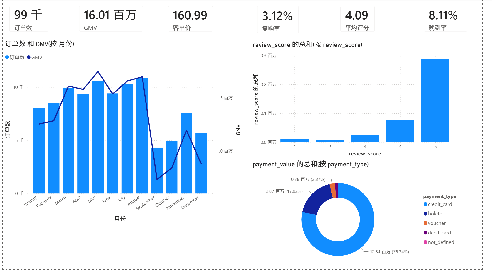
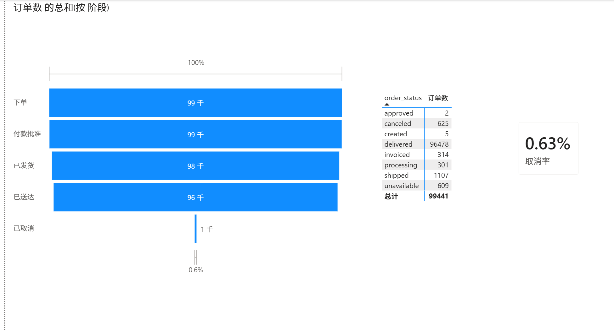
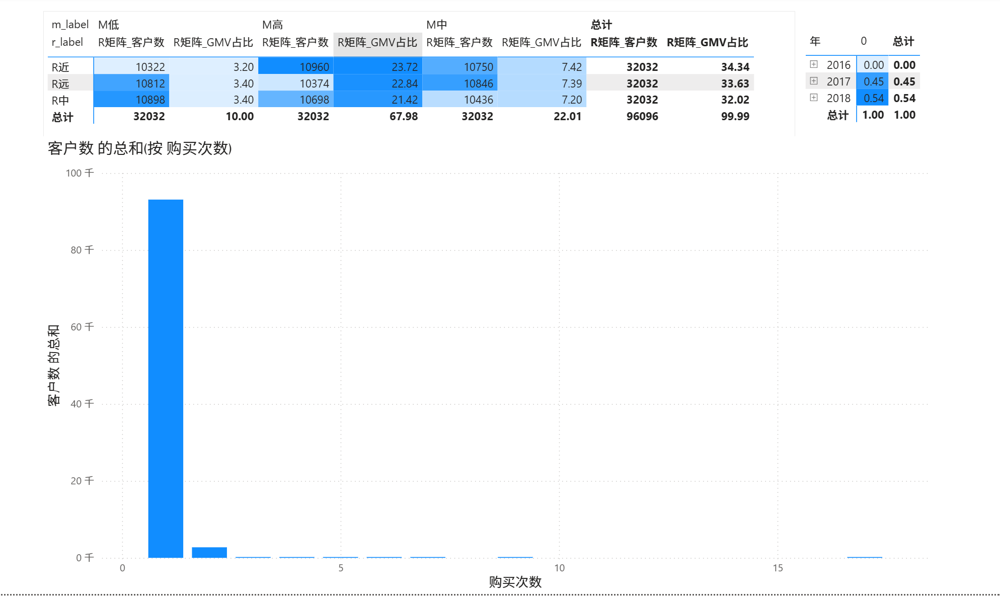
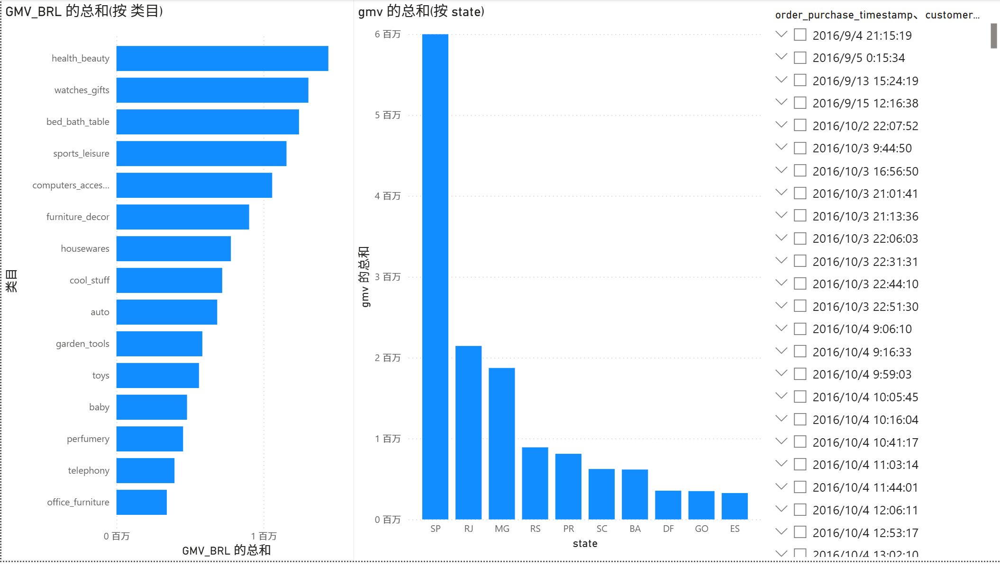
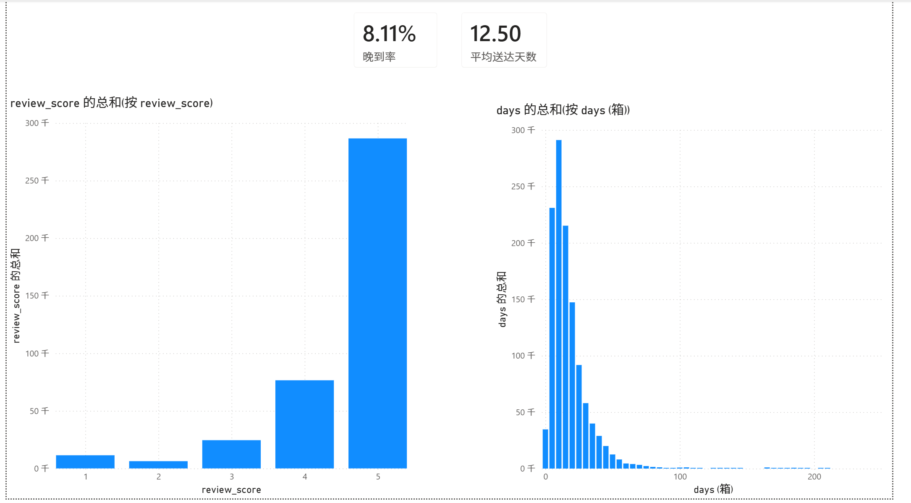

# Olist 巴西电商真实数据分析报告

> 版本 v2(真实数据) · 2026-08-21 · 数据来源：[Kaggle Olist 巴西电商公开数据集](https://www.kaggle.com/datasets/olistbr/brazilian-ecommerce)(2016-09 ~ 2018-10)

---

## TL;DR（一页速览）

**项目**：基于真实电商订单数据的完整分析：Python 清洗入库 MySQL → SQL/Python 分析 → Power BI 看板。

**规模**：99,441 单 · 96,096 客户 · 32,951 商品 · GMV ≈ 1,600 万 BRL · 客单价 161 BRL

5 条核心结论
1. **订单漏斗健康**：下单→付款批准 99.8% →发货 98.2% →送达 97.0%，取消率仅 0.63%。注意漏斗起点已过滤无效流量，不能与全流量转化漏斗类比。
2. **平台是"拉新模式"**：复购率仅 3.12%，96.9% 客户只买过 1 单，月度留存长期个位数 → 运营重心应是**获客与客单价**，而非留存。
3. **RFM 的 F 失效，改用 R+M 分层**：前 1/3 高消费客户（M 高）贡献 68% GMV、人均 340 BRL。
4. **高价值客户同样一次性流失**：R×M 九宫格各格人数均衡，"M 高 ≠ 高忠诚"；对首单高消费客户二次触达可能有增量（需 A/B 验证）。
5. **区域与季节集中**：SP 州贡献 37.5% GMV；2017-11 黑五为全年峰值；晚到率 8.1%；平均评分 4.09。

**诚实声明**：巴西市场 2016-2018 数据，无浏览/加购日志（漏斗为订单状态口径），全部结论为描述性统计。与模拟数据的关键差异：**真实数据里不存在"40% 用户贡献 90% GMV"这类设计出来的结论**。

**文件导航**：`README.md`（项目说明）· `notebooks/邱泽凯_olist真实数据分析.ipynb`（分析过程）· `sql/olist/`（分析 SQL）· `report/电商用户行为分析看板_olist.pbix`（Power BI 看板）

---

## 1. 数据与 ETL 质量

9 张表入 MySQL（ecommerce 库，`olist_*` 前缀）：

| 表 | 行数 | 说明 |
|---|---|---|
| orders | 99,441 | 订单主表（状态 + 各环节时间戳） |
| order_items | 112,650 | 商品明细（价格/运费/卖家） |
| order_payments | 103,886 | 支付（方式/分期/金额） |
| order_reviews | 99,224 | 评价（1-5 分） |
| customers | 99,441 | 订单级 customer_id + 真实客户 customer_unique_id |
| products | 32,951 | 商品（类目/尺寸/重量） |
| sellers | 3,095 | 卖家 |
| geolocation | 1,000,163 | 邮编坐标（本版未做地图） |

**数据质量处理（ETL 阶段，可体现严谨性）**
1. 列名拼写错误（`product_name_lenght` 等）→ 已标准化；
2. `review_id` 重复 → 评价表不设主键；
3. 有效分析区间实为 **2017-01 ~ 2018-08**（2016 年 <100 单、2018-09 后仅 16/4 单）；
4. 1 笔订单无支付记录，GMV 以支付表为准。

## 2. 分析结果

### 2.1 订单状态漏斗

| 环节 | 订单数 | 转化率 |
|---|---|---|
| 下单 | 99,441 | — |
| 付款批准 | 99,281 | 99.84% |
| 发货 | 97,658 | 98.21% |
| 送达 | 96,476 | 97.02% |
| 取消 | 625 | 0.63% |

主要损失为"不可用/缺货"（609 单）+ 取消（625 单），合计约 1.2%。因订单由卖家确认后才进入系统，漏斗起点已过滤大部分无效流量，**该漏斗反映履约质量，而非流量转化**。

### 2.2 GMV 与支付

- GMV ≈ 1,600.9 万 BRL（16,008,872），客单价 161 BRL（中位数 105.3），最大单 13,664 BRL。
- 支付：信用卡 78.3%、boleto 17.9%、voucher 2.4%、借记卡 1.4%。
- 金额集中度：Top 1% 订单占 10.5%，Top 10% 占 38.3%，Top 20% 占 53.4%——金额右偏但**远没有"二八法则"那么极端**。

### 2.3 客户价值：复购、留存、R+M 分层

- **复购率 3.12%**：96.88% 客户只买 1 单（93,099 人），2 单 2.86%，3 单 0.21%，最高 17 单（1 人）。
- **RFM 的 F 无区分度** → 改用 **R+M 三分位分层**：

| 分层 | 客户数 | GMV 占比 | 人均 BRL |
|---|---|---|---|
| M 高（前 1/3） | 32,032 | 68.0% | 339.8 |
| M 中 | 32,032 | 22.0% | 110.0 |
| M 低 | 32,032 | 10.0% | 50.0 |

- **R×M 矩阵**：R 近/中/远 × M 高/中/低，九宫格人数均约 1.0~1.1 万——M 高客户在三个 R 区间分布均匀，即**高消费客户同样主要是一次性客户**；其中 R近×M高（10,960 人）贡献 GMV 23.7%，是最值得运营的群体。
- **留存**：月度 cohort 留存长期个位数，多数 cohort 第 1 月即 <3%，之后趋近 0 → 印证"拉新模式"。

### 2.4 时间 / 品类 / 地区 / 评价 / 物流

- **时间**：2017-11 黑五峰值（7,544 单 / 119.5 万 BRL）；周一订单最多（16,196），周六最少；10:00–17:00 为下单高峰（白天工作时段下单，巴西特征）。
- **品类 Top 5**：health_beauty 9.1%、watches_gifts 8.2%、bed_bath_table 7.8%、sports_leisure 7.3%、computers_accessories 6.7%。
- **地区**：SP 州 37.5% GMV（41,745 单 / 599.8 万），RJ 13.4%、MG 11.7%；圣保罗市单城 13.8%。
- **评价**：平均 4.09 分，J 型分布（5 星 57.8%、1 星 11.5%）；office_furniture 评分最低（3.62）。
- **物流**：平均送达 12.5 天 vs 承诺 24.4 天，**晚到率 8.1%**，平均提前 11.9 天（承诺偏保守）。

## 3. 结论与业务建议

1. **拉新 + 客单价驱动**：复购率 3.1%、留存个位数 → 预算倾向获客与首单体验，而非留存激励。
2. **高价值 ≠ 高忠诚**：M 高客户占 GMV 68% 但一次性流失，对首单高消费客户做二次触达（会员/券）可能有增量（需 A/B 验证）。
3. **履约是口碑关键**：8% 晚到 + 1 星差评占 11.5%，物流与商品质量是评分两大抓手。
4. **区域聚焦**：SP/RJ/MG 三州占 GMV 62%，可优先区域化供给与物流。
5. **季节节奏**：黑五为绝对峰值，备货与营销资源提前配置。

## 5. Power BI 看板（5 页）

看板文件：`report/电商用户行为分析看板_olist.pbix`（数据直连 MySQL `ecommerce` 库 `olist_*` 表）。

## 6. 复现与文件导航

复现命令见 `README.md`（下载数据 → ETL 入库 → 跑 SQL → 生成图表，四步）。本报告结论由 `scripts/olist_analysis.py` 与 `sql/olist/` 复现；原始数据与数据库凭据不入库（git 忽略）。